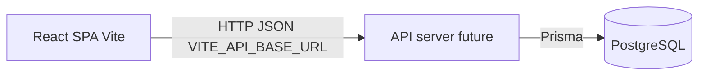

# OneView architecture

Phase-1 Resource Management System — frontend prototype evolving toward PostgreSQL + Prisma + PIN auth.

## Hosting phases

| Phase | Database |
|-------|----------|
| **Now** | Local PostgreSQL (`docs/postgres-local-setup.md`) |
| **Later** | Docker (`docker-compose.yml`) — same `DATABASE_URL` |

## Runtime topology (target)

Today the SPA still reads **mock modules** under `data/*`. Prisma schema + seed already mirror masters; the API layer is next.

## Frontend layers

| Layer | Location | Role |
|-------|----------|------|
| Routes / guards | `routes.tsx`, `ProtectedRoute` | Public login vs shell; permission keys |
| Shell | `components/AppShell.tsx` | Nav from `navConfig` + allowed keys |
| Screens | `screens/*` | Page UI |
| Contexts | `context/*` | Auth session, settings, projects, cockpit role |
| Mocks | `data/*` | Temporary domain data |
| Tokens | `index.css`, `theme/tokens.css` | Brand / status colors |

## Screen → permission → data / tables

| Route | Permission key | Mock module(s) | DB tables (now or next) |
|-------|----------------|----------------|-------------------------|
| `/login` | — | `accessRights`, `employees` | `employees.pin_hash` |
| `/cockpit` | `my_workspace` | `cockpit`, `executive` | (reports/views later) |
| `/planner` | `planner` | `planner` | `allocations` |
| `/availability` | `availability` | `availability` | `allocations` (capacity later) |
| `/utilization` | `utilization` | `utilization` | derived from `allocations` later |
| `/confirmations` | `confirmations` | `confirmation` | plan from `allocations`; store in `work_confirmations` |
| `/reports/*` | `reports.*` | `*Report.ts` | derived from `allocations` + `work_confirmations` |
| `/my-team/weekly-check-in*` | `my_team.weekly_check_in` | `weeklyCheckIn` | `weekly_check_in_submissions` (queue/workspace/history) |
| `/masters/weekly-check-in` | `masters.weekly_check_in` | `weeklyCheckIn` | `weekly_check_in_settings`, `weekly_check_in_competencies` |
| `/masters` | `masters.*` | `setup` | `departments`, `skills`, `activities`, `activity_milestones` |
| `/employees` | `employees` | `employees` | `employees`, `employee_skills`, `employee_permissions` |
| `/projects` | `projects` | `projects` | `projects`, `project_milestones`, `project_demand_lines` |
| `/settings` | `settings` | `settings` | `app_settings`, `company_off_days` |
| `/access-rights` | `access_rights` | `accessRights` | `employee_permissions` |

Permission keys are the contract: `data/navConfig.ts` ↔ Access Rights UI ↔ future API.

## Auth flow (target)

1. User submits email + 5-digit PIN.
2. `POST /api/auth/login` → Prisma lookup → `bcrypt.compare` vs `pin_hash`.
3. Session cookie/token; client stores allowed keys (or fetches `/api/auth/me`).
4. `AuthContext` replaces mock `signIn(email)`.

Seeded demo PIN: **`12345`** for all employees. Super admin: `admin@acme.io`.

## Quality gates

| Gate | Command |
|------|---------|
| Lint | `npm run lint` |
| Unit | `npm run test:unit` |
| Build | `npm run build` |
| E2E smoke | `npm run build` then `npm run test:e2e` |
| CI | `.github/workflows/ci.yml` |

## Related docs

- [`postgres-local-setup.md`](postgres-local-setup.md)
- [`database.md`](database.md)
- [`api-contract.md`](api-contract.md)
- [`prompt-log.md`](prompt-log.md)
- [`theme.md`](theme.md)
